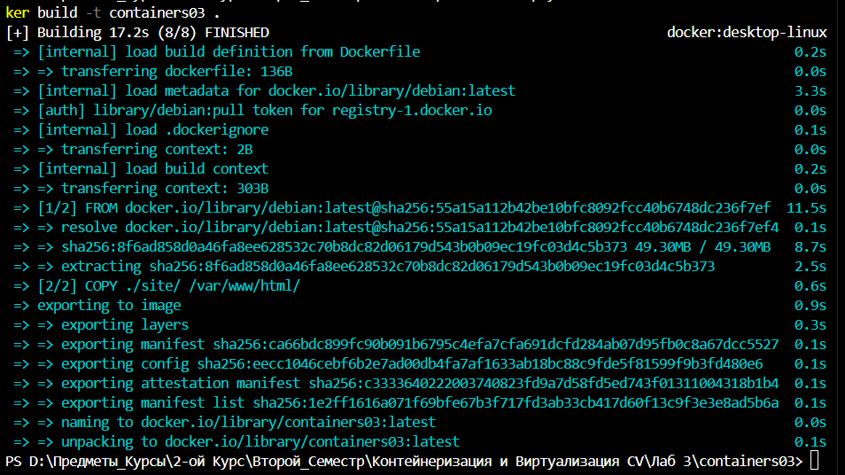

# Первый контейнер

## Цель работы

Данная лабораторная работа знакомит с основами контейнеризации и подготавливает рабочее место для выполнения следующих лабораторных работ.

## Задание

Установить Docker Desktop и проверить его работоспособность.

## Описание выполнения работы с ответами на вопросы

Время создания: 17.2s



 В консоли было выведено:

```text
 hello from c32d1200a1c0
```

На экране после пересоздания было выведено:

```text
total 4
-rwxr-xr-x 1 root root 231 Mar 23 06:54 index.html
```

## Выводы

Я установил Docker Desktop на свой Компьютер и проверил его работоспособность.

## Используемые источники

- [Moodle](https://elearning.usm.md/mod/assign/view.php?id=282116)
- [GitHub](https://github.com/Dimoooh036/containers03)
